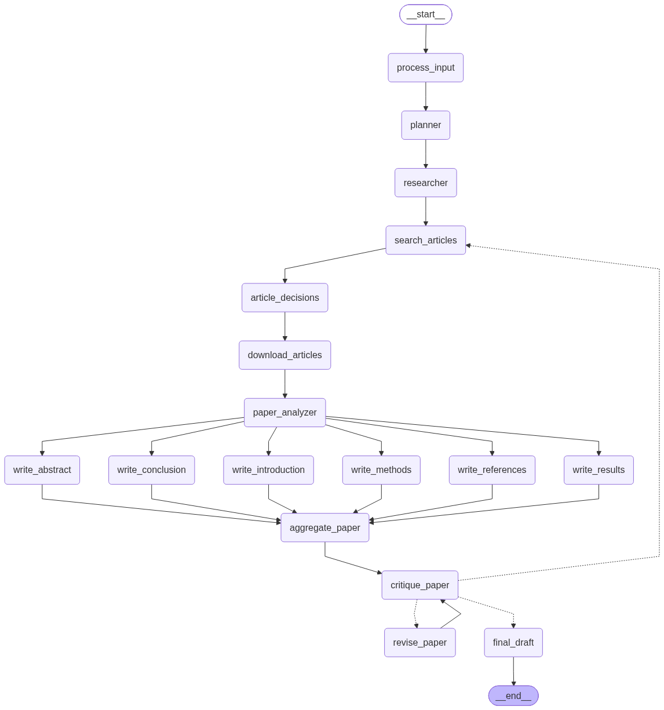

# 🔬 AI System to Automatically Review and Summarize Research Papers

[](https://www.python.org/)
[](https://github.com/langchain-ai/langgraph)
[](https://pymupdf.readthedocs.io/)
[](https://gradio.app/)
[](https://infyspringboard.onwingspan.com/)
[](https://opensource.org/licenses/MIT)

> **Infosys Springboard Internship Project**  
> **Mentor:** Ankit Kumar Tripathy, Data Scientist  
> **Author:** Naman Bhatt  

An autonomous, multi-agent AI system designed to conduct systematic literature reviews and cross-paper syntheses. Powered by a stateful **LangGraph StateGraph** architecture, it automates the full pipeline from academic scoping and PDF retrieval to parallel draft generation and self-correcting peer-review loops.

---

## 📌 Table of Contents
- [Architecture & Workflow](#-architecture--workflow)
- [Milestone Delivery Checklist](#-milestone-delivery-checklist)
- [Key Features](#-key-features)
- [System Requirements & Tech Stack](#-system-requirements--tech-stack)
- [Quickstart & Installation](#-quickstart--installation)
- [Usage Modes](#-usage-modes)
  - [1. Autonomous CLI Execution](#1-autonomous-cli-execution)
  - [2. Interactive Modern Web Dashboard](#2-interactive-modern-web-dashboard)
  - [3. Milestone 4 Gradio Interface](#3-milestone-4-gradio-interface)
  - [4. Graph Visualization & Export](#4-graph-visualization--export)
- [Project Structure](#-project-structure)
- [Quality Scoring & Peer-Review Heuristics](#-quality-scoring--peer-review-heuristics)
- [License & Acknowledgments](#-license--acknowledgments)

---

## 🏗 Architecture & Workflow

The system is governed by a cyclic directed graph architecture using **LangGraph**:




### StateGraph Nodes Breakdown
1. **`process_input`**: Normalizes topic slug, initializes persistent state tracking in SQLite, and validates parameters.
2. **`planner`**: Evaluates research scope, formulates core research questions, and derives optimized search queries.
3. **`researcher`**: Chooses primary queries or targeted secondary queries when triggered by gap detection.
4. **`search_articles`**: Queries the **Semantic Scholar API** (with automated **arXiv** fallback) for relevant open-access papers.
5. **`article_decisions`**: Evaluates candidates based on PDF availability, recency, and abstract richness (configurable limit, default: 3).
6. **`download_articles`**: Downloads open-access PDFs and validates document integrity.
7. **`paper_analyzer`**: Extracts structured markdown via `PyMuPDF4LLM` and isolates problem statements, methodologies, empirical discoveries, and novelty.
8. **Parallel Section Drafters**:
   - `write_abstract`: Generates an impactful abstract constrained strictly to **<= 100 words**.
   - `write_introduction`: Introduces the problem landscape, core concepts, and questions.
   - `write_methods`: Synthesizes experimental protocols and compares algorithms across papers.
   - `write_results`: Consolidates concrete discoveries, metrics, and empirical findings.
   - `write_conclusion`: Synthesizes final takeaways, practical implications, and future directions.
   - `write_references`: Generates deterministic **APA 7th-edition** bibliography and citation mappings.
9. **`aggregate_paper`**: Joins all 6 drafted sections into a unified `draft.md`.
10. **`critique_paper`**: Multi-dimensional quality evaluation (0–10) checking clarity, academic rigor, completeness, and citation usage. Also detects cross-paper knowledge gaps.
11. **`revise_paper`**: Rewrites weak sections incorporating specific actionable feedback, then loops back to `critique_paper`.
12. **`final_draft`**: Packages the publication-ready paper and compiles a standalone HTML report.

---

## 🏆 Milestone Delivery Checklist

| Milestone | Target Weeks | Requirements | Status |
| :--- | :---: | :--- | :---: |
| **Milestone 1** | Week 1–2 | • Setup environment & dependencies.<br>• Automated search via Semantic Scholar API & arXiv.<br>• Automatic PDF selection and download.<br>• Metadata dataset preparation (`papers.json`). | ✅ Complete |
| **Milestone 2** | Week 3–4 | • PyMuPDF4LLM section-wise parsing.<br>• Structured text extraction to Markdown.<br>• Key finding extraction (problems, methods, results, novelty).<br>• Cross-paper comparison matrix (`comparison.md`). | ✅ Complete |
| **Milestone 3** | Week 5–6 | • Parallel GPT-based section drafting.<br>• Strict 100-word limit enforcement on Abstract.<br>• Comparative Methods and Results synthesis.<br>• Deterministic APA 7th-edition reference formatting. | ✅ Complete |
| **Milestone 4** | Week 7–8 | • AI Peer-Review quality evaluation (0–10 scores).<br>• Automated revision loopback (`revise_paper` & gap re-search).<br>• **Gradio UI** with interactive 'Critique / Revise' controls.<br>• Modern interactive Web Dashboard (Flask/HTML5).<br>• Final compilation of standalone report. | ✅ Complete |

---

## ⚡ Key Features

- **Stateful LangGraph Orchestration**: Built with cyclic execution, fan-out parallel drafting, and intelligent self-reflection.
- **Smart Dual Retrieval**: Semantic Scholar as primary open-access provider with automatic fallback to arXiv.
- **Rich Document Extraction**: Converts multi-column academic PDFs to clean Markdown using `PyMuPDF4LLM`.
- **Parallel Fan-out Section Drafting**: Synthesizes Abstract, Introduction, Methods, Results, Conclusion, and APA References simultaneously.
- **Iterative Reflection & AI Peer Review**: Evaluates prose quality with automated scoring (0–10) across clarity, rigor, and citation density.
- **Dual UI Flexibility**:
  - **Modern Web Dashboard**: Glassmorphic UI with pipeline status, interactive paper picker, and real-time history.
  - **Milestone 4 Gradio App**: Native Gradio interface with dedicated tabs and live "Critique / Revise" buttons.

---

## 💻 System Requirements & Tech Stack

- **Language:** Python 3.10+
- **Orchestration:** `langgraph`, `langchain-core`
- **PDF Extraction:** `pymupdf4llm`
- **LLM Engine:** OpenAI API / OpenRouter (`gpt-4o-mini`, `gpt-4o`, etc.)
- **User Interfaces:** `gradio` and `flask`
- **State & Storage:** SQLite (`data/state.db`) + local file artifacts

---

## 🚀 Quickstart & Installation

### 1. Clone the repository
```bash
git clone https://github.com/<your-username>/ai-research-reviewer.git
cd ai-research-reviewer
```

### 2. Set up virtual environment
```bash
python3 -m venv .venv
source .venv/bin/activate
pip install -r requirements.txt
```

### 3. Configure environment variables
Copy `.env.example` to `.env`:
```bash
cp .env.example .env
```
Edit `.env` with your API credentials:
```env
OPENAI_API_KEY=your_openai_or_openrouter_key_here
OPENAI_BASE_URL=https://api.openai.com/v1   # or https://openrouter.ai/api/v1
APP_API_KEY=research_secret_123
```

---

## 🎮 Usage Modes

### 1. Autonomous CLI Execution
Execute the entire LangGraph workflow directly from your terminal:
```bash
python main.py run "Quantum Key Distribution in Satellite Networks" --limit 3
```

### 2. Interactive Modern Web Dashboard
Launch the polished web dashboard:
```bash
python main.py ui --port 5001
```
Open `http://localhost:5001` in your browser. Enter `APP_API_KEY` (configured in `.env`) to access:
- Live paper search and interactive paper selection.
- Real-time pipeline execution progress.
- Embedded report viewer.

### 3. Milestone 4 Gradio Interface
Launch the Gradio interface:
```bash
python main.py gradio --port 7860
```
Open `http://localhost:7860` in your browser:
- Input research topics and adjust paper count.
- View real-time tabs: **Draft**, **Quality Scores**, **Cross-Paper Comparison**, **Selected Literature**, and **Strategy**.
- Click **"Critique / Revise Draft"** to trigger interactive refinement on demand!

### 4. Graph Visualization & Export
Display the architecture diagram and export it to PNG/Mermaid:
```bash
python main.py graph --export docs/architecture_graph.png
```

---

## 📂 Project Structure

```
.
├── main.py                     # Unified CLI & entry point
├── requirements.txt            # Dependency specifications
├── README.md                   # Project documentation
├── .env.example                # Environment template
│
├── src/
│   ├── graph/                  # LangGraph StateGraph engine
│   │   ├── state.py            # TypedDict ResearchState schema
│   │   ├── nodes.py            # 16 Graph nodes implementation
│   │   └── workflow.py         # Graph compilation, edges & routing
│   │
│   ├── core/                   # Core research engines
│   │   ├── planner.py          # Scoping and strategy formulation
│   │   ├── retrieval.py        # Semantic Scholar & arXiv client
│   │   ├── extraction.py       # PyMuPDF4LLM PDF parser
│   │   ├── analysis.py         # Finding extraction & gap detection
│   │   ├── drafting.py         # 6-section academic drafting
│   │   ├── references.py       # APA 7th bibliography generator
│   │   └── reviewer.py         # AI peer-review & heuristic scoring
│   │
│   ├── ui/                     # Gradio interface (Milestone 4)
│   │   └── gradio_app.py       # Interactive Gradio application
│   │
│   ├── api/                    # Web Application & REST API
│   │   ├── app.py              # Flask server & background runners
│   │   ├── security.py         # Auth & rate-limiting middleware
│   │   └── templates/
│   │       └── dashboard.html  # Glassmorphic SaaS dashboard
│   │
│   ├── reports/
│   │   └── report_generator.py # Standalone HTML report generator
│   │
│   ├── data/
│   │   └── state_manager.py    # SQLite state & artifact ledger
│   │
│   └── utils/
│       └── logger.py           # Structured logger
│
├── data/                       # Local research artifact store (git-ignored)
│   ├── raw_pdfs/               # Downloaded research PDFs
│   ├── processed_text/         # Extracted markdown documents
│   ├── analysis/               # JSON findings & comparison matrix
│   ├── metadata/               # strategy.json & papers.json
│   └── drafts/                 # draft.md, refined_draft.md, report.html
│
└── docs/
    ├── architecture_graph.png  # Rendered LangGraph state diagram
    └── architecture_graph.mermaid
```

---

## 📊 Quality Scoring & Peer-Review Heuristics

The `DraftReviewer` module evaluates each generated draft across four dimensions:
1. **Clarity**: Analyzes sentence length variance, readability, and readability penalties for overly dense prose.
2. **Academic Rigor**: Evaluates critical thinking keywords (`contrast`, `limitation`, `bottleneck`, `tension`).
3. **Completeness**: Checks section-specific word budgets (including the **<= 100-word** constraint on the Abstract).
4. **Citation Usage**: Regex-based verification of `(Author, Year)` and `(Author et al., Year)` in-text citations.

If any section scores below the threshold (`REVIEW_PASSING_SCORE = 7`), the system triggers an automatic rewrite prompt with precise feedback.

---

## 📜 License & Acknowledgments

This project is licensed under the [MIT License](LICENSE).

Developed as part of the **Infosys Springboard Internship Program**. Special thanks to mentor **Ankit Kumar Tripathy** for architecture guidance and mentorship throughout the project.
