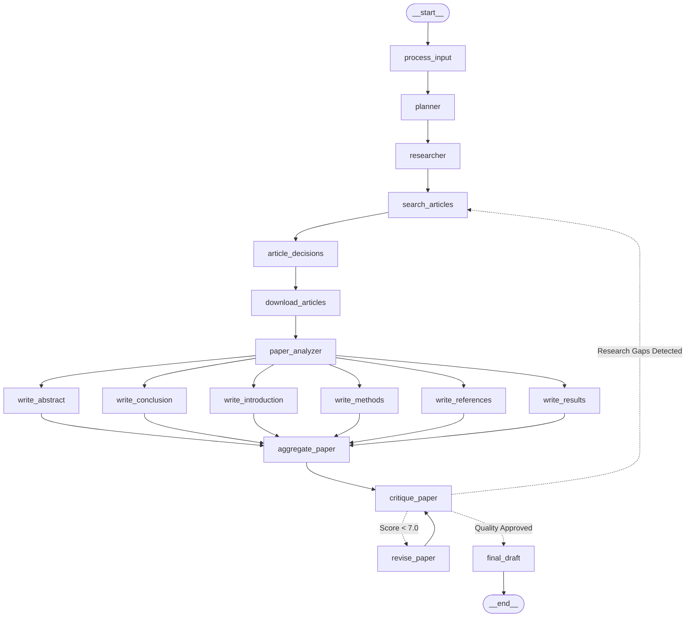
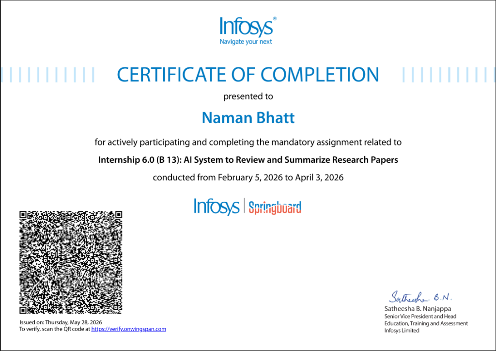

# 🔬 AI System to Automatically Review and Summarize Research Papers

[](https://www.python.org/)
[](https://github.com/langchain-ai/langgraph)
[](https://pymupdf.readthedocs.io/)
[](https://infyspringboard.onwingspan.com/)
[](https://opensource.org/licenses/MIT)

> **Infosys Springboard Internship 6.0 (Batch 13)**  
> **Mentor:** Ankit Kumar Tripathy, Data Scientist  
> **Author:** Naman Bhatt  

An autonomous, multi-agent AI system designed to conduct systematic literature reviews and cross-paper syntheses. Powered by a stateful **LangGraph StateGraph** architecture, it automates the full pipeline from academic scoping and PDF retrieval to parallel section drafting and self-correcting peer-review loops.

---

## 📌 Table of Contents
- [Architecture & Workflow](#-architecture--workflow)
- [Key Capabilities](#-key-capabilities)
- [Tech Stack](#-tech-stack)
- [Quickstart & Usage](#-quickstart--usage)
- [Project Structure](#-project-structure)
- [Internship Certificate of Completion](#-internship-certificate-of-completion)
- [License & Acknowledgments](#-license--acknowledgments)

---

## 🏗 Architecture & Workflow

The system is governed by a cyclic directed graph architecture using **LangGraph**:



<p align="center">
  
</p>

### Pipeline Execution Stages:
1. **Scoping & Planning (`planner`)**: Deconstructs the research topic, identifies key research questions, and prepares targeted search queries.
2. **Retrieval (`search_articles`, `download_articles`)**: Queries Semantic Scholar with automatic arXiv fallback, or directly ingests user-provided paper URLs/PDFs.
3. **Deep Extraction (`paper_analyzer`)**: Uses `PyMuPDF4LLM` to extract multi-column academic text, isolate methodologies, and identify empirical findings.
4. **Parallel Section Drafting (`write_*`)**: Fans out to generate Abstract (strictly $\le 100$ words), Introduction, Comparative Methods, Empirical Results, Synthesis, and deterministic APA 7th bibliography simultaneously.
5. **Quality Assessment & Self-Correction (`critique_paper`, `revise_paper`)**: Evaluates drafts using heuristic rubrics (Clarity, Rigor, Completeness, Citations). Re-routes weak sections for automated refinement before producing the final draft.

---

## ⚡ Key Capabilities

- **Direct Paper Link & PDF Ingestion**: Accepts direct URLs (arXiv, Nature, DOI, or direct `.pdf` links) to review specific literature on demand without search ambiguity.
- **Smart Dual Retrieval**: Combines the Semantic Scholar academic graph with arXiv fallback for open-access PDF resolution.
- **Parallel Multi-Agent Drafting**: Independent specialized agents draft discrete sections simultaneously, merging into a unified synthesis.
- **Rigorous Heuristic Peer-Review**: Evaluates academic prose across clarity, citation density, and structure with automatic rewrite loops.
- **Production Web Dashboard**: Responsive single-page workbench featuring interactive paper screening, live progress timelines, KaTeX mathematical typesetting, inline section critique/revision, and publication exports (`Copy`, `.md`, `Print/PDF`).

---

## 💻 Tech Stack

- **Orchestration:** `langgraph`, `langchain-core`
- **PDF Extraction:** `pymupdf4llm`, `pymupdf`
- **LLM Engine:** OpenAI API / OpenRouter (`gpt-4o-mini`, `gpt-4o`)
- **Web Application:** Python Flask, Vanilla CSS (Glassmorphic Dark Theme), KaTeX
- **State & Persistence:** SQLite (`data/state.db`) + Structured File Ledger

---

## 🚀 Quickstart & Usage

### 1. Installation
```bash
# Clone the repository
git clone https://github.com/Namanbhatt-01/ai-research-reviewer.git
cd ai-research-reviewer

# Create and activate virtual environment
python3 -m venv .venv
source .venv/bin/activate

# Install dependencies
pip install -r requirements.txt
```

### 2. Configuration
Copy `.env.example` to `.env` and add your API credentials:
```env
OPENAI_API_KEY=your_openai_or_openrouter_api_key
OPENAI_BASE_URL=https://api.openai.com/v1   # or https://openrouter.ai/api/v1
APP_API_KEY=research_secret_123
```

### 3. Running the Application

#### A. Interactive Web Dashboard (Recommended)
```bash
python main.py ui --port 5001
```
Open `http://localhost:5001` in your browser. Enter your `APP_API_KEY` to access paper screening, live pipeline execution, and interactive literature review reading.

#### B. Autonomous Terminal Orchestrator
```bash
# Review a research topic
python main.py run "Quantum Key Distribution in Satellite Networks" --limit 3

# Review a paper directly from a link or PDF
python main.py run "https://arxiv.org/abs/1706.03762"
```

#### C. Export Graph Architecture Diagram
```bash
python main.py graph --export docs/architecture_graph.png
```

---

## 📂 Project Structure

```
.
├── main.py                     # Unified CLI: Terminal Orchestrator & Web Server
├── requirements.txt            # Production dependencies
├── README.md                   # Documentation & overview
├── LICENSE                     # MIT License
├── .env.example                # Configuration template
│
├── src/
│   ├── api/                    # Web Application & Security Layer
│   │   ├── app.py              # Flask server, background runners, streaming endpoints
│   │   ├── security.py         # API key auth, rate-limiter, path traversal sanitizer
│   │   └── templates/
│   │       └── dashboard.html  # Modern single-page research workbench
│   │
│   ├── core/                   # Core Research Engines
│   │   ├── planner.py          # Topic scoping and query formulation
│   │   ├── retrieval.py        # Semantic Scholar & direct paper/PDF resolver
│   │   ├── extraction.py       # PyMuPDF section-by-section text extractor
│   │   ├── analysis.py         # Finding extraction & cross-paper gap detection
│   │   ├── drafting.py         # 6-section academic drafting engine
│   │   ├── references.py       # APA 7th bibliography generator & citation linker
│   │   └── reviewer.py         # Heuristic scoring (0–10) & LLM section refinement
│   │
│   ├── graph/                  # LangGraph Workflow Architecture
│   │   ├── state.py            # TypedDict ResearchState schema
│   │   ├── nodes.py            # 16 Graph node functions
│   │   └── workflow.py         # Graph compilation & feedback routing
│   │
│   ├── reports/
│   │   └── report_generator.py # Standalone offline HTML export generator
│   │
│   ├── data/
│   │   └── state_manager.py    # SQLite state & artifact ledger
│   │
│   └── utils/
│       └── logger.py           # Structured logger
│
├── tests/                      # Automated Test Suite (16/16 Passing)
│   ├── test_api_and_ui.py
│   ├── test_drafting_and_references.py
│   ├── test_graph_workflow.py
│   ├── test_retrieval.py
│   └── test_reviewer.py
│
└── docs/                       # Architecture & Assets
    ├── architecture_graph.png  # Rendered LangGraph state diagram
    ├── architecture_graph.mermaid
    └── certificate_of_completion.png
```

---

## 🎓 Internship Certificate of Completion

> **Infosys Springboard Internship 6.0 (Batch 13)**  
> **Project:** *AI System to Review and Summarize Research Papers*  
> **Conducted:** *February 5, 2026 – April 3, 2026*  
> **Verification Portal:** [verify.onwingspan.com](https://verify.onwingspan.com)

<p align="center">
  
</p>

---

## 📜 License & Acknowledgments

This project is licensed under the [MIT License](LICENSE).

Developed as part of the **Infosys Springboard Internship Program**. Special thanks to mentor **Ankit Kumar Tripathy** for architecture guidance and mentorship throughout the project.
